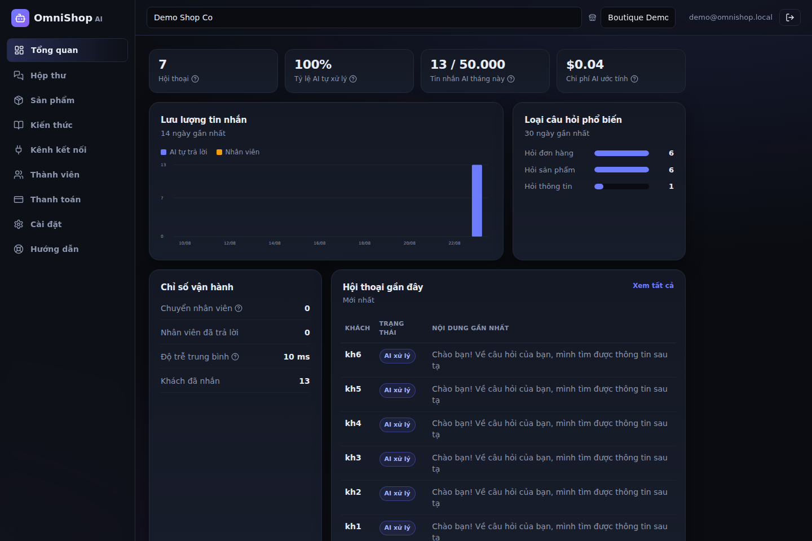
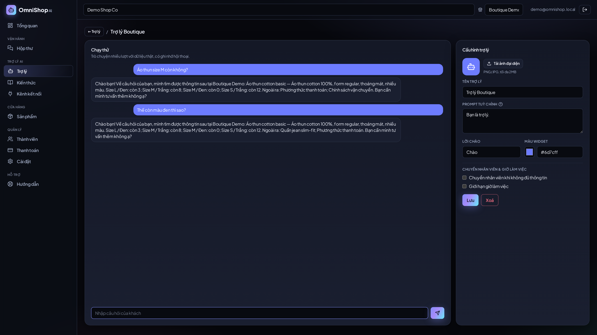
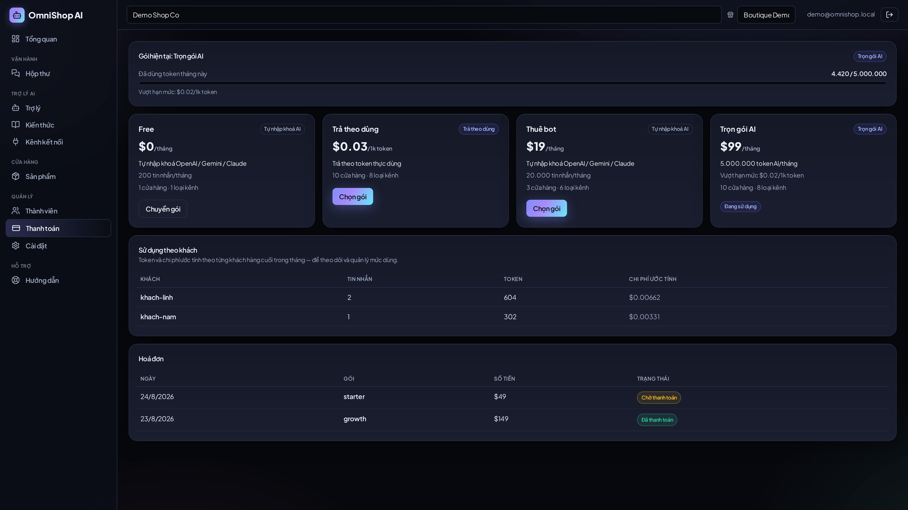
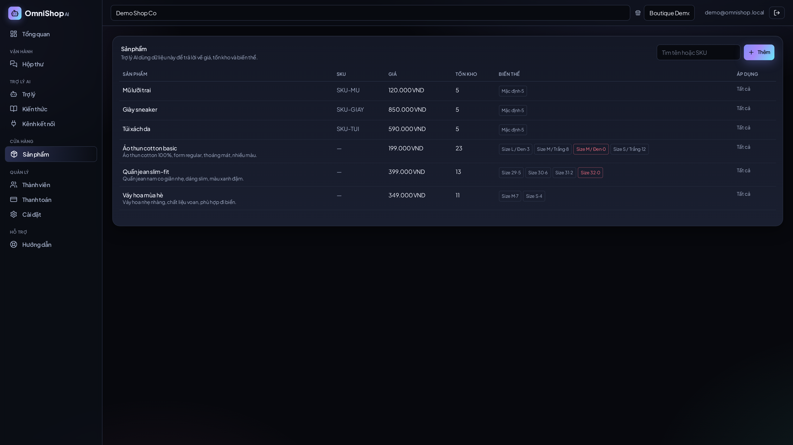
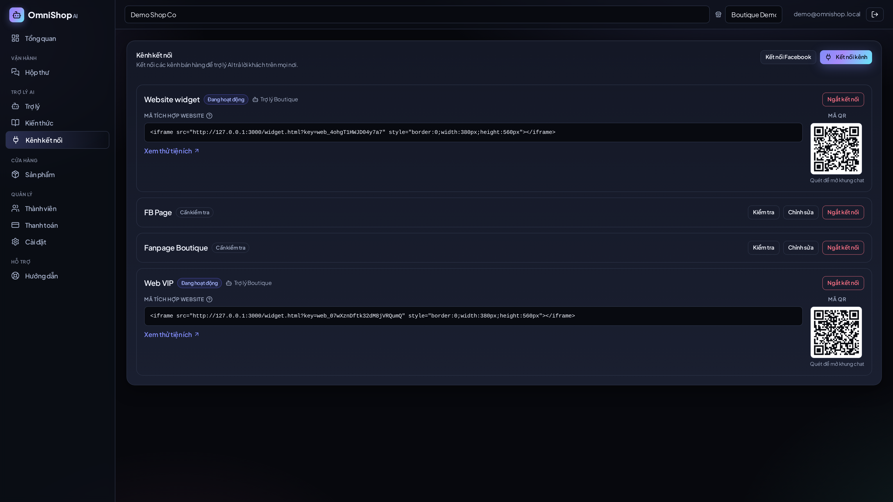

<h1 align="center">OmniShop AI</h1>

<p align="center">
  <b>Nền tảng SaaS chatbot AI đa tenant cho nhà bán hàng social & thương mại điện tử.</b><br/>
  Đăng ký → kết nối kênh → trợ lý RAG tự trả lời khách, đa kênh, tự chuyển nhân viên khi cần.
</p>

<p align="center">
  
  
  
  
  
</p>

<p align="center">
  
</p>

> **Pay → Connect → AI works.** Người bán không cần biết phía sau có vector DB,
> LLM, OAuth, webhook hay Docker.

---

## Tính năng

- 🧩 **Đa tenant, cô lập 3 lớp** — app scoping + PostgreSQL Row-Level Security + lọc metadata vector.
- 🤖 **Nhiều trợ lý / cửa hàng** — prompt riêng, avatar, giờ làm việc, chuyển nhân viên; chạy thử full màn có memory.
- 🔎 **RAG hybrid** — pgvector (ngữ nghĩa) + pg_trgm (từ khoá) hợp nhất bằng RRF; ingest **bất đồng bộ** ở worker, xem được văn bản trích xuất & trạng thái.
- 🔌 **Đa kênh** — Website, Messenger/Instagram, Telegram, Zalo OA, WhatsApp Cloud, TikTok Shop, Shopee.
- 💳 **Thanh toán** — VietQR, VNPay, MoMo, Stripe (ký giao dịch thật, có return/IPN/webhook).
- 💰 **Định giá linh hoạt** — gói tự-nhập-khoá (BYOK) / trọn gói AI / trả-theo-dùng; quản lý token theo tenant & theo từng khách.
- 🎛️ **Admin làm chủ mọi cấu hình trên UI** — LLM/OCR, cổng thanh toán, Facebook App, Google Sign-In, gói & đơn giá, thương hiệu (logo/tên).
- 🔐 **Đăng nhập** email/mật khẩu + **Google OAuth**; vai trò nền tảng **admin / manager (chỉ đọc + xuất báo cáo)**; nhật ký hoạt động; thu hồi phiên.
- 🧠 **Đa nhà cung cấp AI** — Anthropic / OpenAI / Gemini / vLLM-local (chọn model + test ngay trong app).

## Ảnh giao diện

| Trợ lý — chạy thử (memory + RAG) | Định giá & token |
|---|---|
|  |  |

| Sản phẩm | Kết nối kênh |
|---|---|
|  |  |

Xem đầy đủ 22 ảnh Full HD: [`docs/screenshots/`](docs/screenshots/README.md).

## Chạy thử (không cần API key)

```bash
docker compose up -d --build                    # db(pgvector) · redis · api · worker · web
docker compose exec api python -m scripts.seed  # tenant demo + sản phẩm + kiến thức
# mở http://localhost:3000   (đăng nhập: demo@omnishop.local / demo12345)
```

API tự chạy migration và bootstrap admin lúc khởi động. Chọn nhà cung cấp AI, cổng
thanh toán, kênh… ngay trong UI Quản trị. Chạy test: `pytest`.

## Kiến trúc (tóm tắt)

```
web (Vite/React)  ──/api──►  FastAPI  ──►  PostgreSQL 16 + pgvector (RLS)
                                 │
                                 ├─►  Redis (hàng đợi)  ──►  worker (extract · chunk · embed)
                                 └─►  Providers: LLM · Embedding · Vector · Channel · Payment · Email · OCR
```

Backend Python 3.11 + FastAPI + psycopg3; frontend tách riêng (Tailwind, font
Plus Jakarta Sans tự host). Mọi nhà cung cấp đứng sau interface có thể thay thế.

## Tài liệu

| Chủ đề | Tài liệu |
|---|---|
| Triển khai & sao lưu | [docs/deployment.md](docs/deployment.md) |
| Định giá & quản lý token | [docs/pricing.md](docs/pricing.md) |
| RAG & xử lý tài liệu | [docs/rag-and-ingestion.md](docs/rag-and-ingestion.md) |
| Tích hợp thanh toán & kênh | [docs/integrations.md](docs/integrations.md) |
| Đăng nhập & phân quyền | [docs/auth-and-roles.md](docs/auth-and-roles.md) |
| Cấu hình & mô hình bán lại | [docs/operations/config-and-reseller.md](docs/operations/config-and-reseller.md) |
| Tự phản biện & giới hạn | [docs/self-review.md](docs/self-review.md) |
| Kiến trúc / ADR / cost / risk | [docs/](docs/) |

## Bảo mật (giai đoạn đầu)

Cô lập tenant bằng RLS (có test), secret **mã hoá khi lưu**, không API nào trả key
thô về client, mật khẩu PBKDF2, token ký HS256, rate-limit đăng nhập. Trước khi
phục vụ thật: đặt **`APP_SECRET`** mạnh, đổi mật khẩu DB, chạy sau **HTTPS** — xem
[docs/deployment.md](docs/deployment.md).
