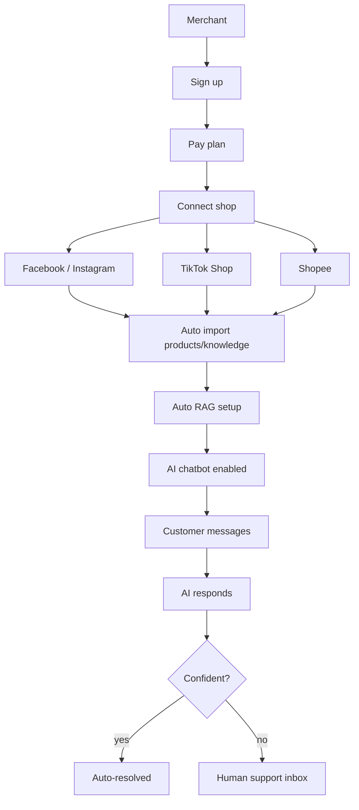
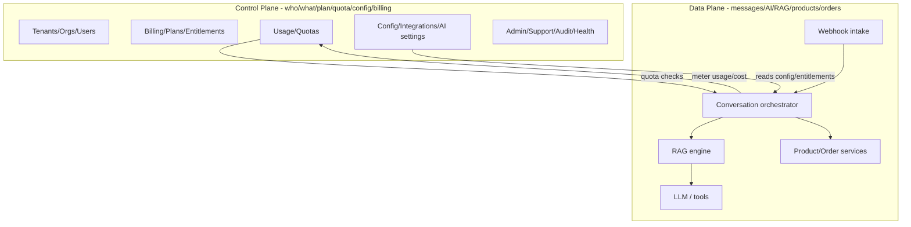
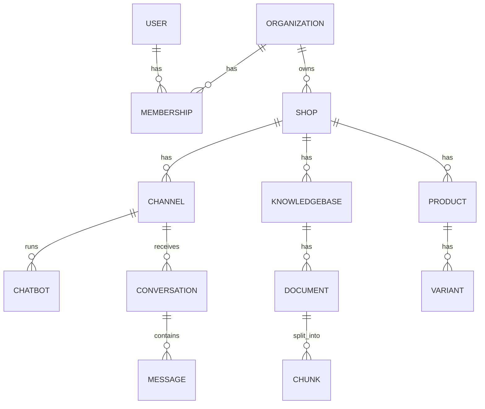
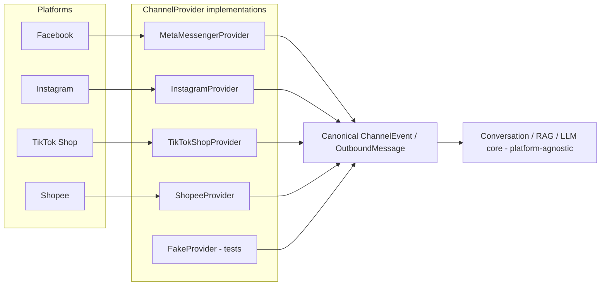
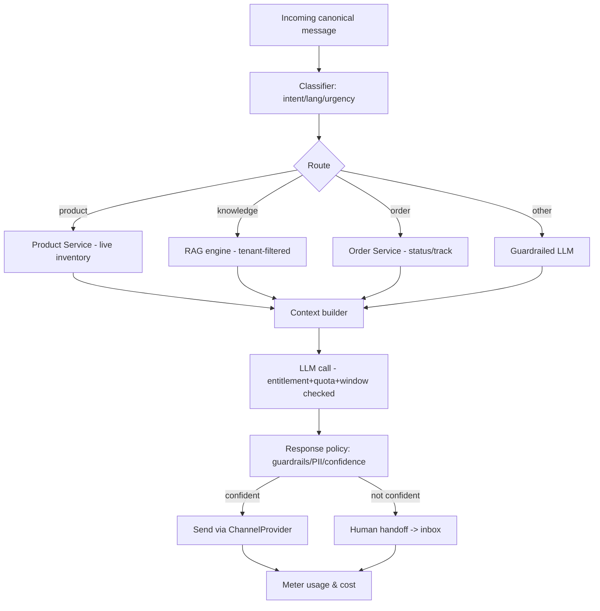
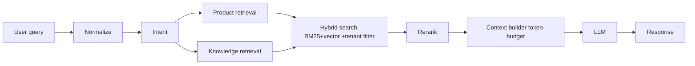
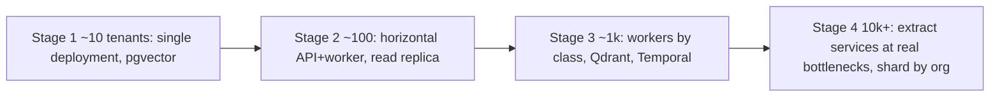

# Architecture Diagrams

Diagrams referenced from [`overview.md`](overview.md), collected here as Mermaid
(renders on GitHub) plus ASCII fallbacks.

## 1. System context — the merchant journey

## 2. Control plane / data plane

## 3. Multi-tenancy entity model

## 4. Channel adapter boundary

## 5. Conversation orchestration flow

## 6. RAG pipeline

## 7. Scaling stages

